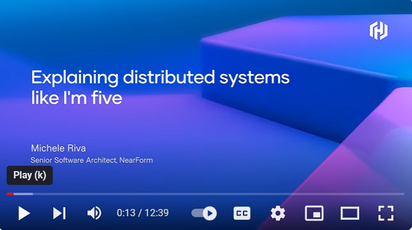
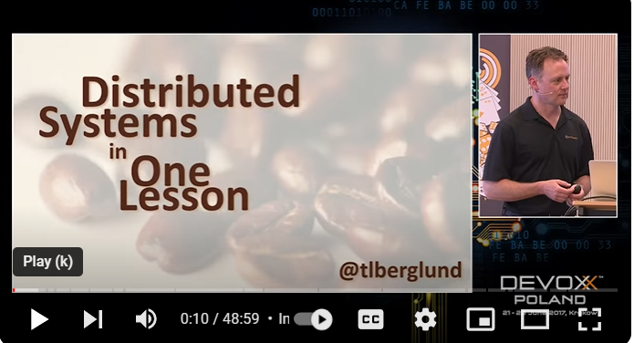

# Introduction to Distributed Systems and Distributed Computing

Welcome to the exciting world of Distributed Systems! In this course, we will explore the fascinating field of distributed computing, where multiple computers work together to solve complex problems. 

**Distributed systems** are a key part of our daily lives, even if we don’t always realise it. When you use the internet to send an email, stream a movie, or even just browse a webpage, you’re interacting with distributed systems. These systems allow us to process large amounts of data quickly and reliably, making them essential for many modern technologies. 

From the vast network of servers that make up the cloud, to the interconnected devices in the Internet of Things, distributed systems are all around us. Join us as we delve into the principles and practices that underpin these crucial systems. Let’s embark on this journey!

In this lecture, we will be introducing Distributed Computing  Systems, considering their characteristics and models. 

## An overview of Distributed Systems

Watch this video by Tim Berglund presenting an overview of Distributed Systems in one Lesson:

Slides
